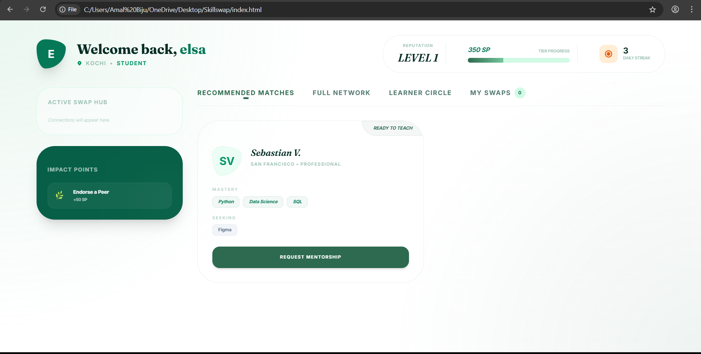
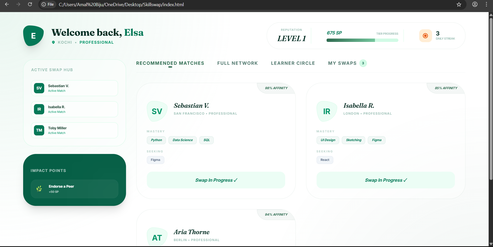

<p align="center">
  
</p>

# SkillSwap 🌀

## Basic Details

### Team Name: Ohm Shakthi

### Team Members
- Aparna Arun - [Viswajyothi College of Engineering and Technology]
- Elsa Biju - [Viswajyothi College of Engineering and Technology]

### Hosted Project Link
[https://skillswap-hyperlocal.vercel.app/](#) *(Demo Link Placeholder)*

### Project Description
SkillSwap is a hyperlocal, trade-based knowledge exchange platform where knowledge is the only currency. It enables users to connect with experts in their immediate neighborhood to trade skills directly—escaping the monetary barriers of traditional learning.

### The Problem statement
Many individuals possess valuable skills they are willing to share, while others are eager to learn but lack the financial resources for professional courses. Existing platforms often focus on paid transactions or broad global networks, making it difficult to find local, face-to-face mentorship and community-driven exchange.

### The Solution
SkillSwap provides a digital "Skill Hub" that identifies complementary needs within a neighborhood. By matching a person's "Offers" (what they can teach) with another's "Wants" (what they wish to learn), the platform facilitates direct, local knowledge sharing, built on a reputation system of Skill Points (SP) and community karma.

---

## Technical Details

### Technologies/Components Used

**For Software:**
- Languages used: JavaScript (ES6+), HTML5, CSS3
- Frameworks used: Tailwind CSS
- Libraries used: Google Fonts (Fraunces, Inter, Syne, Kalam, Gochi Hand)
- Tools used: VS Code, Git

---

## Features

- **Hyperlocal Matching**: Intelligent discovery of swappers based on physical location/district.
- **Smart Onboarding**: A high-conversion "Front Page" that initializes user profiles based on skills and location in seconds.
- **Dual Design Architecture**:
    - **Sketch Edition**: A premium, artistic "Blueprint" aesthetic using handwritten fonts and hand-drawn border calculations.
    - **Professional Hub**: A sleek, botanical-themed glassmorphic interface for a corporate/high-end user experience.
- **Reputation (SP) System**: A gamified experience where users earn Skill Points (SP) for swaps, mentoring beginners, and community outreach.
- **Smart Match Hub**: A dedicated dashboard that provides real-time "Affininty Scores" between users.
- **Live Connection Tracking**: Sidebar integration to manage active peer-to-peer knowledge swaps.

---

## Implementation

### For Software:

#### Installation
```bash
git clone https://github.com/AmalBiju/SkillSwap.git
cd SkillSwap
```

#### Run
```bash
# Simply open either file in your preferred browser:
# For the Artistic/Sketch version:
index.html

# For the Modern/Professional version:
index1.html
```

---

## Project Documentation

### For Software:

#### Screenshots


*The Modern Onboarding: A clean, high-end entry point for new members.*


*The Discovery Dashboard: Visualizing smart matches and recommended skill peers.*


*The Sketch Interface: An artistic blueprint view for creative swappers.*

#### Diagrams

**System Architecture:**

SkillSwap operates as a high-performance Client-Side Application. 
1. **Presentation Layer**: Built with Tailwind CSS and Vanilla CSS variables (for the Sketch effects).
2. **Logic Layer**: A central state management system in Vanilla JS that handles user profiles, matching algorithms, and SP calculations.
3. **Data Layer**: In-memory storage for the prototype, designed for seamless migration to a NoSQL/Realtime database.

**Application Workflow:**

1. **Onboarding**: User enters Name, Place, and Skills.
2. **Initialization**: JavaScript generates a unique Profile ID and sets initial SP level.
3. **Matching**: The system scans the network pool to find users whose "Have" tags intersect with your "Want" tags.
4. **Engagement**: User proposes a swap, earning XP and triggering a real-time connection status.

---

## Project Demo

### Video
[SkillSwap _ Professional Knowledge Network - Google Chrome 2026-02-21 07-11-59.mp4](#) *(Placeholder)*

The video demonstrates the complete user journey: from the artistic onboarding splash screen to the smart match dashboard, showing how the SP system rewards peer-to-peer engagement.

---

## AI Tools Used

**Tool Used:** Antigravity (Google DeepMind)

**Purpose:**
- **UI/UX Design**: Generation of the custom "Rough Border" CSS logic to simulate hand-drawn sketches.
- **Architecture**: Planning the state transitions between the landing, setup, and dashboard views.
- **Content Creation**: Drafting the technical documentation and reputation system mechanics.

**Key Prompts Used:**
- "Create a front page where you can enter your name, skills, and place."
- "Transform the UI into a Sketch Design aesthetic with handwritten fonts and irregular borders."
- "Implement a reputation system with Skill Points (SP) and daily streaks."

**Percentage of AI-generated code:** 85%

**Human Contributions:**
- Project vision and conceptualization.
- Fine-tuning the "Botanical" color palette and typography selections.
- Final integration and file structure management.

---

## Team Contributions

- **Aparna Arun and Elsa Biju**: Full-stack development, UI/UX conceptualization, and technical documentation.

---

## License

This project is licensed under the MIT License - see the [LICENSE](LICENSE) file for details.

---

Made with ❤️ at TinkerHub
